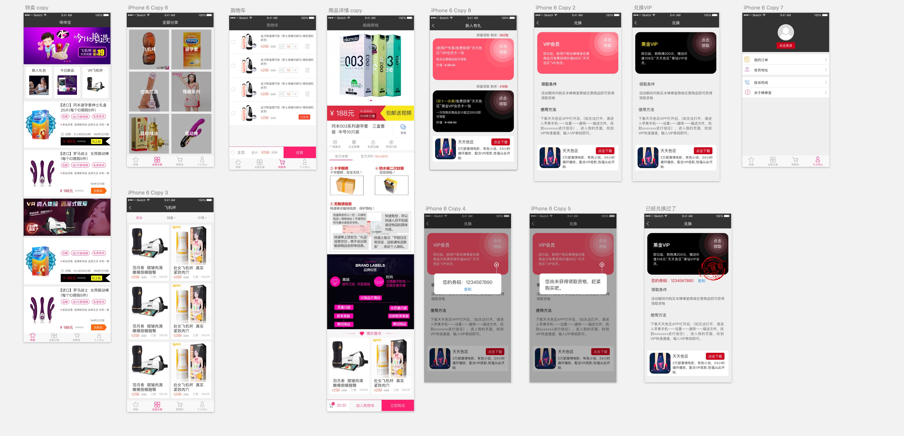

#情趣商城-QBStore
##原始效果图

##代码结构
- Vendor
	- AlipaySDK：支付宝SDK
	- WeChatSDK：微信支付SDK
	- UMMobClick：友盟统计
	- MZTimerLabel：倒计时控件
	- SDCycleScrollView：图片滚动控件
- Utils
	- `QBSConfiguration`：基本配置(内容接口baseUrl、支付接口baseUrl、渠道号、接口注册的appId、支付接口的版本号)
	- `QBSErrorHandler`：错误处理类，用于显示错误消息
	- `QBSHttpClient`：网络请求处理的基础类
	- `QBSHUDManager`：消息提示管理器
	- `QBSRESTManager`：处理具体业务接口的网络类
	- `QBSUIHelp`：用于处理一些普遍的UI/页面操作
	- `QBSWeChatHelper`：微信登录的辅助类
- Database
- Extensions
- Payment
- MVCs
	- Base
	- Home
	- CustomerService
	- Account
	- Cart
	- Category
	- Commodity
	- List
	- Order
	- Mine
	- Debug
